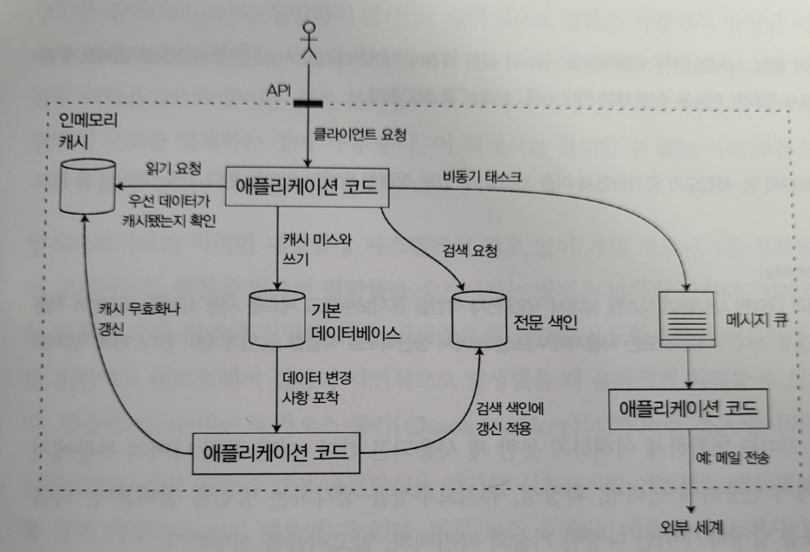

# 신뢰할 수 있고 확장 가능하며 유지보수하기 쉬운 애플리케이션

- 오늘날 많은 애플리케이션은 **계산 중심(compute-intensive)** 과는 다르게 **데이터 중심(data-intensive)** 적이다. 
- 데이터 중심 애플리케이션은 표준 구성 요소(standard building block)로 만든다.
- 그래서 아래와 같은 것들이 필요함
    - 데이터베이스
    - 캐시
    - 검색 색인(search index)
    - 스트림 처리 (stream processing)
    - 일괄 처리 (batch processing)

[다양한 구성 요소를 결합한 데이터 시스템 아키텍처의 예]

- 소프트웨어 시스템에서 중요하게 여기는 세가지
    - 신뢰성(Reliability)
    - 확장성(Scalability)
    - 유지보수성(Maintainability)

## 신뢰성
- 올바르게 동작함, 무언가 잘못되더라도 지속적으로 올바르게 동작함
- 잘못될 수 있는 일 : 결함(fault)
- 결함을 예측하고 대처할 수 있는 시스템 : 내결함성(fault-tolerant) 또는 탄력성(resilient)를 지녔다 라고 말함

### 하드웨어 결함
